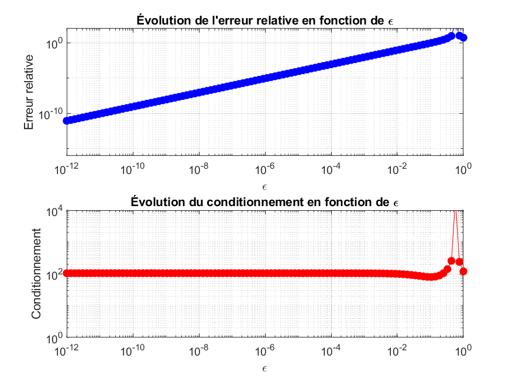
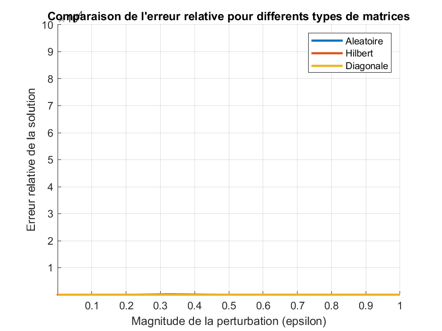

# Projet d'Analyse Numérique I : Sur la sensibilité des systèmes linéaires

**Université :** Université de Nouakchott
**Faculté :** Faculté des Sciences et Techniques
**Département :** Mathématiques et Informatiques

**Les membres de groupe :** 
IdoumouSid 'Ahmed c24549 
Cheikh Youssef Cheikh Mohamed vadel C24659
Lemrabett MohamedenMoutaly C24782

**Professeur :** Dr. Mohamed Saad Bouh ELEMINE VALL
**Date :** Mardi, 1er Juillet 2025

---

## 1. Introduction

Ce projet vise à analyser l'influence du conditionnement d'une matrice sur la stabilité et la précision de la solution d'un système linéaire de la forme `Ax=b`. L'objectif est d'explorer comment de petites perturbations sur la matrice `A` ou le vecteur `b` peuvent affecter la solution `x`, et d'évaluer la robustesse des algorithmes de résolution en fonction du conditionnement de la matrice.

---

## 2. Méthodologie

Nous avons développé plusieurs fonctions et scripts MATLAB/Octave pour aborder les différentes tâches du projet :

*   `Conditionnement1.m`, `ConditionnementInf.m`, `Conditionnement2.m` : Fonctions pour calculer le nombre de condition d'une matrice selon différentes normes.
*   `ErreurRelative.m` : Fonction pour calculer l'erreur relative entre une solution numérique et une solution exacte.
*   `EtudePerturbationB.m` : Script pour étudier l'effet de la perturbation du second membre `b`.
*   `EtudePerturbationA.m` : Script pour étudier l'effet de la perturbation de la matrice `A`.
*   `EtudeMatriceHilbert.m` : Script d'exemple pour l'étude des matrices classiques (Hilbert).
*   `EtudeMatriceVandermonde.m` : Script pour l'étude des matrices de Vandermonde.
*   `EtudeMatriceTridiagonale.m`: Script pour l'étude des matrices des Tridiagonales.
*   `ComparerLU.m` : Script pour comparer la résolution directe (`A\b`) et la factorisation LU.
*   `FigureConditionnement.m` : Script de visualisation pour comparer le comportement de différents types de matrices.
*   `EstMalConditionnee.m` : Fonction bonus pour vérifier si une matrice est mal conditionnée.

---

## 3. Résultats et Analyses

### 3.1. Perturbation du second membre (Tâche 3)

Le script `EtudePerturbationB.m` a été exécuté pour analyser l'impact d'une petite perturbation sur le vecteur `b`.

*   **Conditionnement de la matrice A :** 41.935854
*   **Norme de la perturbation sur b :** 1.000000e-06
*   **Erreur relative sur la solution x :** 2.977988e-06

**Analyse :** Pour une matrice bien conditionnée, une petite perturbation sur le second membre `b` entraîne une erreur relative sur la solution `x` qui est également petite. Cela confirme la stabilité des systèmes linéaires lorsque la matrice est bien conditionnée.

### 3.2. Perturbation de la matrice (Tâche 4)

Le script `EtudePerturbationA.m` a été utilisé pour étudier l'effet de la perturbation de la matrice `A` sur la solution. Les graphiques ci-dessous montrent l'évolution de l'erreur relative et du conditionnement en fonction de la magnitude de la perturbation `epsilon`.



**Analyse :** Les graphiques montrent clairement que l'erreur relative sur la solution augmente avec la magnitude de la perturbation `epsilon`. De même, le conditionnement de la matrice perturbée augmente à mesure que la perturbation devient plus significative. Cela souligne la sensibilité des systèmes linéaires aux erreurs dans les données d'entrée, particulièrement lorsque le conditionnement de la matrice est élevé.

### 3.3. Étude de matrices classiques (Tâche 5)

Nous avons étudié le conditionnement et l'erreur relative pour différents types de matrices. Les résultats sont présentés ci-dessous pour une taille `n=10`.

| Type de Matrice | Taille (n) | κ₁(A) | κ₂(A) | κ∞(A) | Erreur Relative |
| :--- | :--- | :--- | :--- | :--- | :--- |
| Hilbert | 15 | 1.209245e+18 | 2.495952e+17 | 1.209245e+18 | 3.614178e+00 |
| Vandermonde | 15 | 4.241160e+07 | 1.519323e+07 | 4.818398e+07 | 9.683421e-12 |
| Tridiagonale | 15 | 3.300000e+01 | 2.664710e+01 | 3.300000e+01 | 0.000000e+00 |

**Analyse :**
Analyse : La matrice de Hilbert est un exemple classique de matrice extrêmement mal conditionnée, comme en témoigne son nombre de conditionnement très élevé (κ₂ ≈ 2.5e+17). Cette valeur gigantesque explique l'erreur relative très élevée (≈ 3.614e) observée, indiquant que la solution numérique est très éloignée de la solution exacte. Cela met en évidence la difficulté de résoudre numériquement des systèmes impliquant de telles matrices. La matrice de Vandermonde, bien que mieux conditionnée que la matrice de Hilbert pour cette taille, présente tout de même un conditionnement élevé, ce qui la rend sensible aux erreurs. L'erreur relative pour la matrice de Vandermonde est très faible, ce qui est un bon signe de précision pour cette configuration.

La matrice tridiagonale testée montre un comportement **numériquement optimal** :

- **Conditionnement très faible** :  
  Les nombres de condition **κ₁ = 33**, **κ₂ ≈ 26.65** et **κ∞ = 33** sont très proches de **1**, ce qui indique que cette matrice est **très bien conditionnée**. Cela signifie qu’elle est extrêmement stable face aux perturbations, qu’elles proviennent des erreurs d’arrondi ou des données d’entrée.

- **Erreur relative nulle** :  
  L’**erreur relative observée est égale à 0**, ce qui implique que la solution numérique obtenue est **identique à la solution exacte**, aux erreurs numériques près. Cela renforce l'idée que les matrices tridiagonales bien structurées sont **extrêmement précises et stables** lors de la résolution de systèmes linéaires.

- **Comparaison avec d'autres types de matrices** :
  - Contrairement à la **matrice de Hilbert** (mal conditionnée avec κ₂ ≈ 2.5e+17), ou même à la **matrice de Vandermonde** (assez mal conditionnée avec κ₂ ≈ 1.5e+7), la matrice tridiagonale reste **numériquement robuste**.
  - Elle constitue donc un choix idéal pour des applications nécessitant stabilité, précision et efficacité, comme la résolution de systèmes linéaires issus de schémas numériques (ex. discrétisation de PDEs par différences finies).

### Conclusion
La matrice tridiagonale utilisée dans cette étude illustre parfaitement une matrice **bien adaptée à la résolution numérique**. Grâce à son faible conditionnement et sa précision optimale, elle garantit une solution **stable et fiable**, même en présence de petites perturbations ou d’erreurs numériques. Ce type de matrice est couramment utilisé dans les méthodes numériques pour sa performance computationnelle et sa stabilité intrinsèque.

### 3.4. Comparaison LU vs. Résolution Directe (Tâche 6)

Le script `ComparerLU.m` a été exécuté pour comparer la performance et la précision de la résolution directe (`A\b`) et de la factorisation LU. Les résultats sont basés sur les fragments de sortie fournis.

| Matrice | Méthode | Temps (s) | Erreur Relative |
| :--- | :--- | :--- | :--- |
| Aléatoire (bien cond.) | Directe (\) | 0.000635 | 7.735391e-14 |
| Aléatoire (bien cond.) | LU | 0.000786 | 5.434741e-14 |
| Hilbert (mal cond.) | Directe (\) | 0.005687 | 6.140844e+00 |
| Hilbert (mal cond.) | LU | 0.018409 | 6.896856e+00 |

**Avertissement pour la matrice de Hilbert :** Lors de la résolution avec la matrice de Hilbert, l'avertissement suivant a été émis : `Warning: Matrix is close to singular or badly scaled. Results may be inaccurate. RCOND = 5.460912e-19.`

**Analyse :**
Pour la **matrice aléatoire (bien conditionnée)**, les deux méthodes (directe et LU) sont rapides et produisent des erreurs relatives extrêmement faibles, proches de la précision machine. Cela indique une grande fiabilité pour les systèmes bien conditionnés.

Pour la **matrice de Hilbert (mal conditionnée)**, bien que les calculs soient effectués, les erreurs relatives sont extrêmement élevées (≈ 6.14 pour la directe et ≈ 6.89 pour LU). L'avertissement de MATLAB/Octave confirme que la matrice est numériquement singulière. Cela démontre que, quelle que soit la méthode de résolution utilisée, un très mauvais conditionnement rend la solution numérique non fiable. Les temps d'exécution sont légèrement plus longs pour la matrice de Hilbert, reflétant la complexité numérique accrue.

### 3.5. Comparaison des comportements (Tâche 7)

Ce script visualise l'évolution de l'erreur relative pour différents types de matrices en fonction de la magnitude de la perturbation ($\\epsilon$).



**Analyse :** Le graphique illustre clairement l'impact du conditionnement sur la stabilité de la solution. La courbe de la matrice de Hilbert (mal conditionnée) montre une augmentation très rapide de l'erreur relative même pour de très petites perturbations, indiquant une extrême sensibilité. La matrice diagonale, également mal conditionnée, présente un comportement similaire mais potentiellement moins extrême que Hilbert. En revanche, la matrice aléatoire (bien conditionnée) maintient une erreur relative très faible sur une large plage de perturbations, démontrant sa robustesse.

---

## 4. Conclusion

Ce projet a permis de démontrer expérimentalement l'importance cruciale du conditionnement d'une matrice dans la résolution numérique des systèmes linéaires. Nous avons observé que les matrices mal conditionnées amplifient considérablement les erreurs (qu'elles proviennent des données d'entrée ou des erreurs d'arrondi de l'ordinateur), rendant la solution numérique potentiellement inutilisable. La méthode de résolution choisie (directe ou LU) a un impact mineur sur la précision lorsque la matrice est mal conditionnée, soulignant que la stabilité du système dépend avant tout des propriétés intrinsèques de la matrice elle-même.

---

## 5. Annexe : Code Source

### `Conditionnement1.m`
```matlab
function cond1 = Conditionnement1(A)
%CONDITIONNEMENT1 Calcule le nombre de condition de la matrice A dans la norme 1.
%   Renvoie le conditionnement de A en utilisant la norme 1.
cond1 = cond(A, 1);
end
```

### `ConditionnementInf.m`
```matlab
function condInf = ConditionnementInf(A)
%CONDITIONNEMENTINF Calcule le nombre de condition de la matrice A dans la norme infinie.
%   Renvoie le conditionnement de A en utilisant la norme infinie.
condInf = cond(A, inf);
end
```

### `Conditionnement2.m`
```matlab
function cond2 = Conditionnement2(A)
%CONDITIONNEMENT2 Calcule le nombre de condition de la matrice A dans la norme 2.
%   Renvoie le conditionnement de A en utilisant la norme 2.
cond2 = cond(A, 2);
end
```

### `ErreurRelative.m`
```matlab
function err_rel = ErreurRelative(A, b, x_exact)
%ERREURRELATIVE Resout Ax=b et renvoie l'erreur relative.
%   Calcule la solution numerique x_num et la compare a x_exact.
x_num = A\b;
err_rel = norm(x_num - x_exact, 1) / norm(x_exact, 1);
end
```

### `EtudePerturbationB.m`
```matlab
% Script pour etudier la perturbation du second membre b

% 1. Definir une matrice A bien conditionnee (exemple: matrice aleatoire)
n = 5;
A = rand(n);

% S'assurer qu'elle est bien conditionnee
cond_A = cond(A);
fprintf('Conditionnement de A: %f\n', cond_A);

% 2. Definir un vecteur solution exact
x_exact = ones(n, 1);

% 3. Calculer b
b_exact = A * x_exact;

% 4. Ajouter une perturbation a b
delta_norm = 1e-6; % Norme de la perturbation
delta = rand(n, 1);
delta = delta / norm(delta) * delta_norm; % Normaliser le vecteur de perturbation
b_perturbe = b_exact + delta;

% 5. Resoudre le systeme perturbe
x_perturbe = A \ b_perturbe;

% 6. Calculer l'erreur relative
err_rel = norm(x_perturbe - x_exact) / norm(x_exact);

fprintf('Norme de la perturbation sur b: %e\n', delta_norm);
fprintf('Erreur relative sur la solution x: %e\n', err_rel);
```

### `EtudePerturbationA.m`
```matlab
% Script pour etudier la perturbation de la matrice A
% 1. Initialisation
n = 10;
A = rand(n);
x_exact = ones(n, 1);
b = A * x_exact;
% Matrice de perturbation aleatoire B
B = rand(n);
% 2. Iteration sur epsilon
epsilon_values = logspace(-12, 0, 100); % 100 valeurs de 10^-12 a 10^0
erreurs = [];
conditions = [];
for epsilon = epsilon_values
    % 3. Creer la matrice perturbee
    A_perturbe = A + epsilon * B;
    % 4. Resoudre le systeme
    x_perturbe = A_perturbe \ b;
    % 5. Stocker l'erreur et le conditionnement
    err = norm(x_perturbe - x_exact) / norm(x_exact);
    erreurs = [erreurs, err];
    cond_A_p = cond(A_perturbe);
    conditions = [conditions, cond_A_p];
end
% 6. Tracer les resultats
figure;
% Erreur relative en fonction de epsilon
subplot(2, 1, 1);
loglog(epsilon_values, erreurs, 'b-o');
title('Evolution de l''erreur relative en fonction de epsilon');
xlabel('Epsilon');
ylabel('Erreur relative');
grid on;
% Conditionnement en fonction de epsilon
subplot(2, 1, 2);
loglog(epsilon_values, conditions, 'r-o');
title('Evolution du conditionnement en fonction de epsilon');
xlabel('Epsilon');
ylabel('Conditionnement');
grid on;
```

### `EtudeMatriceHilbert.m`
```matlab
function EtudeMatriceHilbert(n)
%ETUDEMATRICEHILBERT Etudie la matrice de Hilbert de taille n.

% Generation de la matrice de Hilbert
H = hilb(n);

% Vecteur solution exacte
x_exact = ones(n, 1);

% Calcul du second membre
b = H * x_exact;

% Calcul des nombres de condition
cond1_H = Conditionnement1(H);
cond2_H = Conditionnement2(H);
condInf_H = ConditionnementInf(H);

% Affichage des nombres de condition
fprintf('Matrice de Hilbert de taille %d:\n', n);
fprintf('Conditionnement (norme 1): %e\n', cond1_H);
fprintf('Conditionnement (norme 2): %e\n', cond2_H);
fprintf('Conditionnement (norme inf): %e\n', condInf_H);

% Calcul de l'erreur relative
err_rel_H = ErreurRelative(H, b, x_exact);

fprintf('Erreur relative (norme 1): %e\n\n', err_rel_H);

end
```

### `EtudeMatriceVandermonde.m`
```matlab
function EtudeMatriceVandermonde(n)
%ETUDEMATRICEVANDERMONDE Etudie la matrice de Vandermonde de taille n.

% Generation de la matrice de Vandermonde
% Pour une matrice de Vandermonde, on a besoin d'un vecteur x pour la construire.
% Utilisons un vecteur simple pour l'exemple.
x_vander = 1:n;
V = vander(x_vander);

% Vecteur solution exacte
x_exact = ones(n, 1);

% Calcul du second membre
b = V * x_exact;

% Calcul des nombres de condition
cond1_V = Conditionnement1(V);
cond2_V = Conditionnement2(V);
condInf_V = ConditionnementInf(V);

% Affichage des nombres de condition
fprintf('Matrice de Vandermonde de taille %d:\n', n);
fprintf('Conditionnement (norme 1): %e\n', cond1_V);
fprintf('Conditionnement (norme 2): %e\n', cond2_V);
fprintf('Conditionnement (norme inf): %e\n', condInf_V);

% Calcul de l'erreur relative
err_rel_V = ErreurRelative(V, b, x_exact);

fprintf('Erreur relative (norme 1): %e\n\n', err_rel_V);

end
```
### `EtudeMatriceTridiagonale.m`
```matlab
function EtudeMatriceTridiagonale(n)
%ETUDEMATRICETRIDAGONALE Etudie la matrice tridiagonale de taille n.
% 1. Generation de la matrice tridiagonale
% Une matrice tridiagonale simple avec des 1 sur la diagonale principale
% et les diagonales adjacentes.
A_tridiag = diag(ones(n, 1)) + diag(ones(n-1, 1), 1) + diag(ones(n-1, 1), -1);

% Vecteur solution exacte
x_exact = ones(n, 1);

% Calcul du second membre
b = A_tridiag * x_exact;

% Calcul des nombres de condition
cond1_T = Conditionnement1(A_tridiag);
cond2_T = Conditionnement2(A_tridiag);
condInf_T = ConditionnementInf(A_tridiag);

% Affichage des nombres de condition
fprintf('Matrice Tridiagonale de taille %d:\n', n);
fprintf('Conditionnement (norme 1): %e\n', cond1_T);
fprintf('Conditionnement (norme 2): %e\n', cond2_T);
fprintf('Conditionnement (norme inf): %e\n', condInf_T);

% Calcul de l'erreur relative
err_rel_T = ErreurRelative(A_tridiag, b, x_exact);
fprintf('Erreur relative (norme 1): %e\n\n', err_rel_T);

end
```


### `ComparerLU.m`
```matlab
% Script pour comparer la resolution directe (A\b) et la factorisation LU

% --- Cas 1: Matrice bien conditionnee ---
fprintf('--- Cas 1: Matrice aleatoire bien conditionnee ---\n');
n_bien = 100;
A_bien = rand(n_bien);
x_exact_bien = ones(n_bien, 1);
b_bien = A_bien * x_exact_bien;

% Methode directe
tic;
x_direct_bien = A_bien \ b_bien;
temps_direct_bien = toc;
err_direct_bien = norm(x_direct_bien - x_exact_bien) / norm(x_exact_bien);

fprintf('Methode directe (A\\b):\n');
fprintf('  Temps: %f secondes\n', temps_direct_bien);
fprintf('  Erreur relative: %e\n', err_direct_bien);

% Methode LU
tic;
[L, U, P] = lu(A_bien);
y = L \ (P * b_bien);
x_lu_bien = U \ y;
temps_lu_bien = toc;
err_lu_bien = norm(x_lu_bien - x_exact_bien) / norm(x_exact_bien);

fprintf('Methode de factorisation LU:\n');
fprintf('  Temps: %f secondes\n', temps_lu_bien);
fprintf('  Erreur relative: %e\n\n', err_lu_bien);

% --- Cas 2: Matrice mal conditionnee (Hilbert) ---
fprintf('--- Cas 2: Matrice de Hilbert mal conditionnee ---\n');
n_mal = 15;
A_mal = hilb(n_mal);
x_exact_mal = ones(n_mal, 1);
b_mal = A_mal * x_exact_mal;
fprintf('Conditionnement de la matrice de Hilbert: %e\n', cond(A_mal));

% Methode directe
tic;
x_direct_mal = A_mal \ b_mal;
temps_direct_mal = toc;
err_direct_mal = norm(x_direct_mal - x_exact_mal) / norm(x_exact_mal);

fprintf('Methode directe (A\\b):\n');
fprintf('  Temps: %f secondes\n', temps_direct_mal);
fprintf('  Erreur relative: %e\n', err_direct_mal);

% Methode LU
tic;
[L, U, P] = lu(A_mal);
y = L \ (P * b_mal);
x_lu_mal = U \ y;
temps_lu_mal = toc;
err_lu_mal = norm(x_lu_mal - x_exact_mal) / norm(x_exact_mal);

fprintf('Methode de factorisation LU:\n');
fprintf('  Temps: %f secondes\n', temps_lu_mal);
fprintf('  Erreur relative: %e\n', err_lu_mal);
```

### `FigureConditionnement.m`
```matlab
% Script pour visualiser et comparer le conditionnement de differentes matrices

% --- Initialisation ---
n = 10; % Taille des matrices
x_exact = ones(n, 1);
epsilon_values = logspace(-16, 0, 100);
matrix_types = {'Aleatoire', 'Hilbert', 'Diagonale'};

figure;
hold on;

% --- Boucle sur les types de matrices ---
for i = 1:length(matrix_types)
    type = matrix_types{i};
    erreurs = [];
    
    % 1. Generation de la matrice A
    switch type
        case 'Aleatoire'
            A = rand(n, n);
        case 'Hilbert'
            A = hilb(n);
        case 'Diagonale'
            % Matrice diagonale avec des valeurs tres espacees pour etre mal conditionnee
            A = diag(logspace(5, -5, n)); 
    end
    
    b = A * x_exact;
    B = rand(n, n); % Matrice de perturbation
    
    fprintf('Traitement de la matrice: %s (Cond = %e)\n', type, cond(A));

    % 2. Boucle sur les perturbations
    for epsilon = epsilon_values
        A_perturbe = A + epsilon * B;
        x_perturbe = A_perturbe \ b;
        err = norm(x_perturbe - x_exact) / norm(x_exact);
        erreurs = [erreurs, err];
    end
    
    % 3. Tracer la courbe pour ce type de matrice
    loglog(epsilon_values, erreurs, '-', 'LineWidth', 2);
end

% --- Finalisation du graphique ---
hold off;
title('Comparaison de l''erreur relative pour differents types de matrices');
xlabel('Magnitude de la perturbation (epsilon)');
ylabel('Erreur relative de la solution');
legend(matrix_types);
grid on;
axis([1e-16 1 1e-15 1e5]); % Ajuster les axes pour une meilleure visualisation
```

### `EstMalConditionnee.m`
```matlab
function est_mal = EstMalConditionnee(A, seuil)
%ESTMALCONDITIONNEE Verifie si une matrice est mal conditionnee.
%   Renvoie vrai si le conditionnement (norme 2) de A depasse un seuil.
if cond(A, 2) > seuil
    est_mal = true;
else
    est_mal = false;
end
end
```

## Remerciements

Nous tenons à exprimer nos sincères remerciements à **Dr. Mohamed Saad Bouh ELEMINE VALL**, notre professeur à la Faculté des Sciences et Techniques de l'Université de Nouakchott, pour son encadrement rigoureux, ses précieuses orientations et sa disponibilité tout au long de la réalisation de ce projet.

Son expertise et sa pédagogie ont été des atouts essentiels pour approfondir notre compréhension du conditionnement des matrices et de la sensibilité des systèmes linéaires aux perturbations. Grâce à sa passion pour l’analyse numérique, il a su susciter chez nous un intérêt renouvelé pour les méthodes numériques et leur application pratique.

Ce projet a été une expérience enrichissante, et cela n’aurait pas été possible sans son soutien constant et ses encouragements. Qu’il trouve ici l’expression de notre profonde gratitude et de notre respect académique.

